<p align="center">

</p>

#  React SPA
A single page app (SPA) built with [React](https://reactjs.org/), showcasing solutions for the [JavaScript &amp; React competencies](src/img/assignments) assigned in EvolveU's [Full Stack Developer Program](https://www.evolveu.ca/program).


## [&rarr; Live demo](https://evolveu.netlify.com/)


&nbsp;
&nbsp;


## Installation

You'll need [Git](https://git-scm.com), [Node.js](https://nodejs.org/en/download/) and [npm](http://npmjs.com) installed ([Node.js](https://nodejs.org/en/download/) includes [npm](http://npmjs.com))

```bash
# Clone repository
$ git clone https://github.com/OmarHussainX/evolveu-competencies

# Enter project folder
$ cd evolveu-competencies

# Install dependencies
$ npm install

# Run (should launch in browser, typically at http://localhost:3000/)
$ npm start
```


&nbsp;
&nbsp;


## Usage
<p align="center"></p>

Use the icons at the top to navigate to different areas of the app. From left to right, these are:

* [Home](#home)
* [Calculator](#calculator)
* [Manage a single bank account](#one-bank-account)
* [Manage multiple bank accounts (belonging to one user)](#bank-accounts-manager)
* [View/manage a collection of cities](#cities)
* [View/manage box office gross data in a linked list, queue, and stack](#data-structures)


&nbsp;
&nbsp;


### Home
_[Solution for Comp 120 - ReactJS](src/assignments/Comp%20120%20-%20ReactJS.pdf)_

Displays the React logo.


&nbsp;
&nbsp;


### Calculator
_[Solution for Comp 130 - JavaScript TDD](src/assignments/Comp%20130%20-%20JavaScript%20TDD.pdf)_
<p align="center">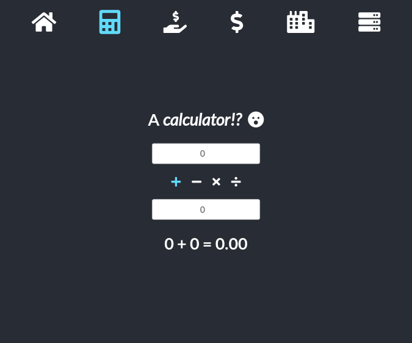</p>

__An exercise in test driven development (TDD) using jest.__
1. Write tests for basic mathematical functions (addition, subtraction, multiplication, division)
2. Write stubs for the mathematical functions
3. Run tests, which _will_ fail
4. Select _one_ function stub and write its code
5. Run tests
   * If tests for the updated function pass, go to step 4
   * Otherwise, revise the code for the function under development and go step 5
6. Repeat steps 4-5 until all code has been written and all tests pass
7. Check for opportunities to refactor/optimise code
8. If a change is made to code, re-run tests - if any fail, resolve them one by one until all tests pass

_NOTE: View test coverage report at 'coverage/lcov-report/src/img/components/js/index.html' after cloning the repo)_

The tested &amp; verified math functions were then used to build a simple calculator in React.


&nbsp;
&nbsp;


### One bank account
_[Solution for Comp 140 - JavaScript Objects and State](src/assignments/Comp%20140%20-%20JavaScript%20Objects%20and%20State.pdf)_
<p align="center">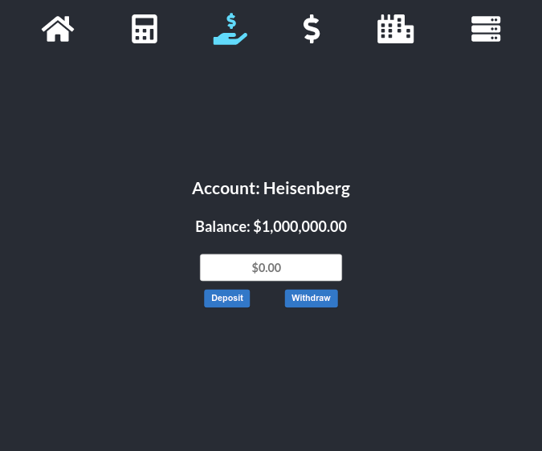</p>

Test driven development of a simple bank `Account` class in JS, to handle management of a single bank account: creation, renaming, deposit/withdrawal, etc.

Although JS classes do not officially have private members, I _was_ able to use private members in my `Account` class by taking advantage of an [experimental private field declaration feature](https://developer.mozilla.org/en-US/docs/Web/JavaScript/Reference/Classes#Field_declarations). (Note that this is only possible since Babel takes care of transpiling the code into common JS suitable for all browsers.)

_NOTE: View test coverage report at 'coverage/lcov-report/src/img/components/js/index.html' after cloning the repo._

The tested &amp; verified bank `Account` class was used to build a solitary account manager in React. _(NOTE: The UI does not allow for the account to be renamed, and the starting balance is pre-determined. These features - and more - will be exposed in the UI of the next section of this SPA.)_


&nbsp;
&nbsp;


### Bank accounts manager
_[Solution for Comp 140 - JavaScript Objects and State](src/assignments/Comp%20140%20-%20JavaScript%20Objects%20and%20State.pdf)_
<p align="center">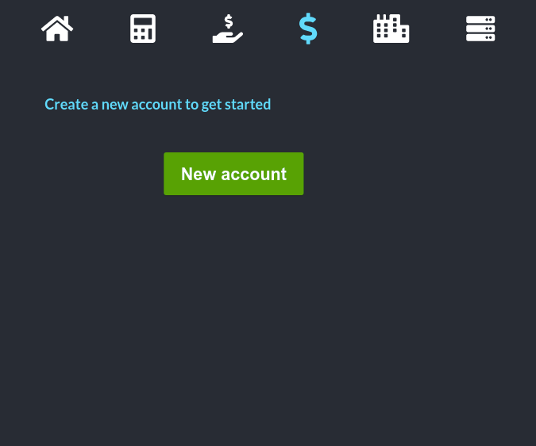</p>

Test driven development of an `AccountsController` class, allowing for the management of a collection of bank `Account` objects. The `AccountsController` class stores bank `Account` objects in a [private array](https://developer.mozilla.org/en-US/docs/Web/JavaScript/Reference/Classes#Field_declarations), and provides several methods for managing the collection of bank `Account` objects, e.g.
* adding, deleting, renaming accounts
* getting the account with highest/lowest balance
* getting the total balance of all accounts
* sorting all accounts in ascending/descending order by name or balance

_NOTE: View test coverage report at 'coverage/lcov-report/src/img/components/js/index.html' after cloning the repo._

The tested &amp; verified `AccountsController` class was used to build a sophisticated bank account manager in React.

&nbsp;

__Creating the first account:__

Until the first bank account is created, the user is presented with a very prominent 'New Account' button, seen above and here, during creation of the initial account.
<p align="center">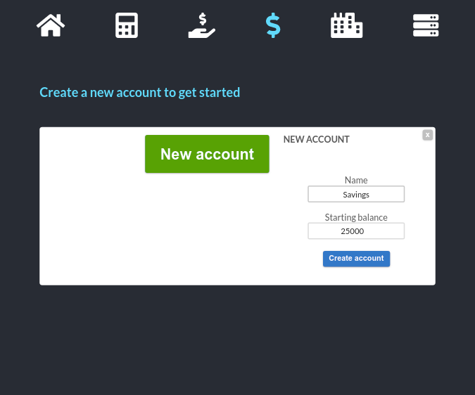</p>

&nbsp;

__Initial account created:__

Now that one account has been created, the 'New Account' button becomes less prominent, but remains easily accessible and highly visible.
<p align="center">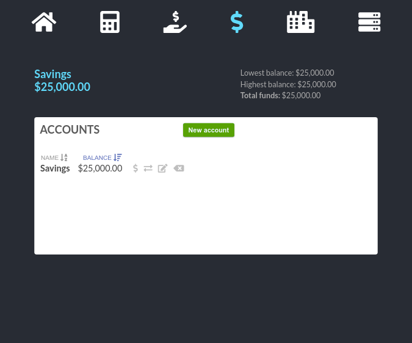</p>

&nbsp;

__Adding a second account:__
<p align="center">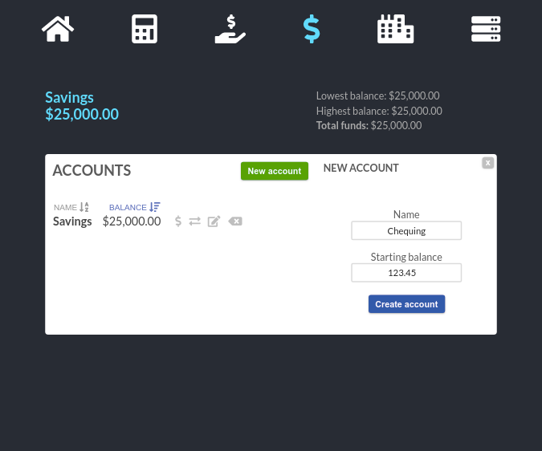</p>

&nbsp;

__After adding several accounts:__

From left to right, the four icons next to the right of each account allow for: deposit/withdrawal, transfer between accounts, account renaming, and account deletion.
<p align="center">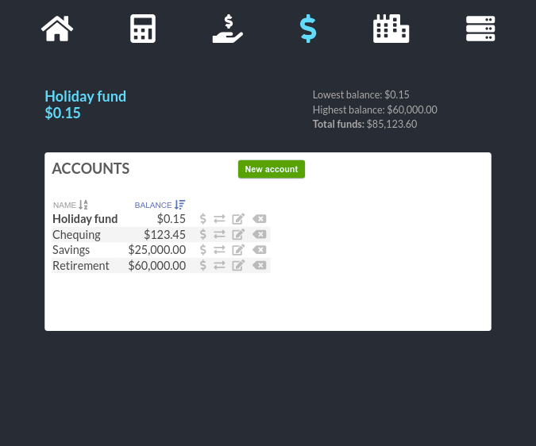</p>

&nbsp;

__Attempting to overdraw an account:__
<p align="center">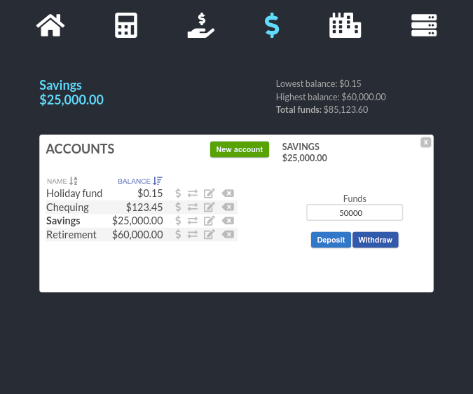</p>

&nbsp;

__An error message is displayed:__

The following operations are not allowed, and cause descriptive error messages to be displayed:
* creating an account with a name that already exists
* making a transfer when only one account exists
* overdrawing an account when withdrawing funds
* overdrawing an account when transferring funds between accounts
<p align="center">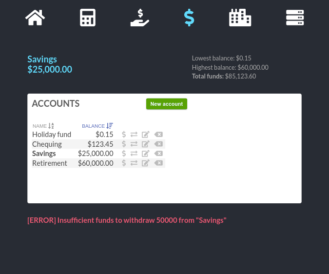</p>

&nbsp;

__Transferring funds between accounts:__

The account selected in the 'From' dropdown is not available in the 'To' dropdown, and vice versa. Whenever the account selected in one dropdown is changed, the other dropdown is updated appropriately. 
<p align="center">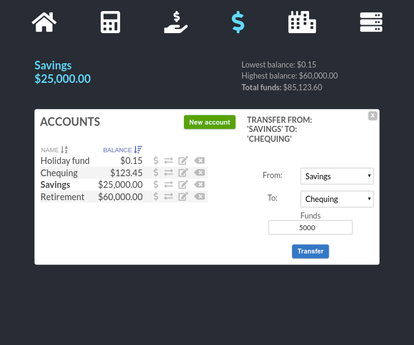</p>

&nbsp;

__Renaming an account:__
<p align="center">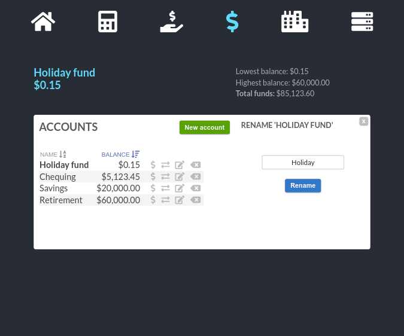</p>

&nbsp;

__Attempting to delete an account:__
<p align="center">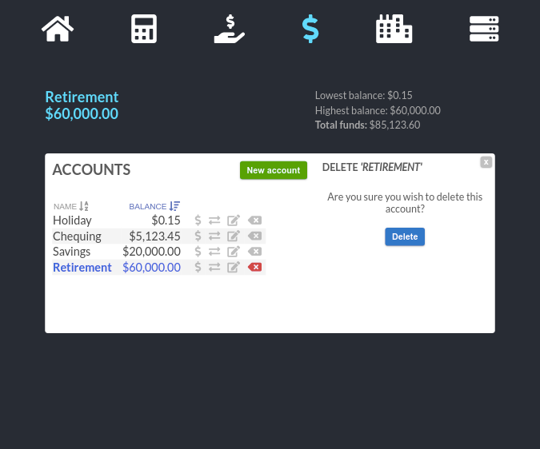</p>

&nbsp;

__Accounts can be sorted by balance, in ascending/descending order:__
<p align="center"></p>

&nbsp;

__Accounts can be sorted by name, in ascending/descending order:__

Note that the active sorting criteria (name or balance) is highlighted in blue, and there is visual indication (via arrow glyphs) of ascending/descending order.
<p align="center">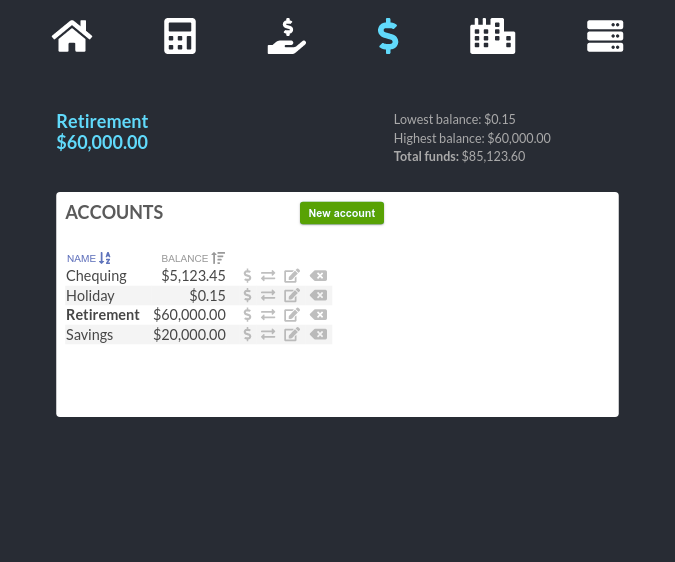</p>

&nbsp;

__After deleting an account:__
<p align="center">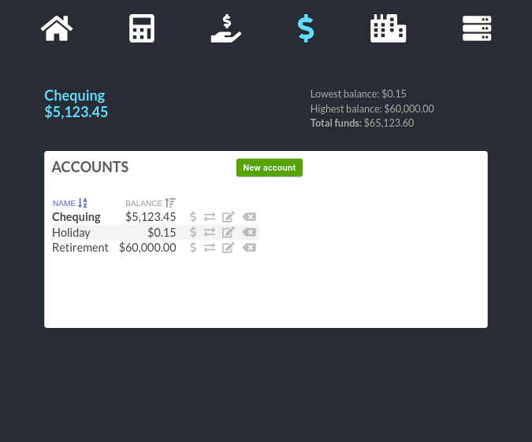</p>


&nbsp;
&nbsp;


### Cities
_[Solution for Comp 140 - JavaScript Objects and State](src/assignments/Comp%20140%20-%20JavaScript%20Objects%20and%20State.pdf)_
<p align="center">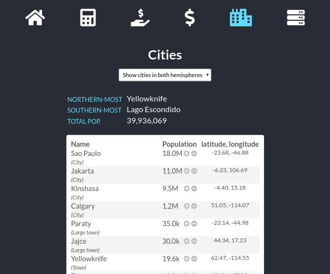</p>

Test driven development of `City` and `Community` classes, where a `City` object has properties:
* name
* latitude
* longitude
* population

and methods to:
* obtain a `String` representation of the city
* grow/shrink the population
* obtain a classification from 'City' -> 'Large town' -> 'Town' -> 'Village' -> 'Hamlet' based on its population

A `Community` consists of a collection of `City` objects, with methods to:
* filter the community of cities based on latitude, returning a new community of cities in either the Northern or Southern hemisphere
* obtain the Nothern-most &amp; Southern-most cities in the community
* obtain the total population of all cities in the community

The city data is loaded from a JSON file I created from actual population data, and when the 'Cities' app first loads, a community containing all cities is presented to the user.

The user can choose (via the dropdown) to display cities in a particular hemisphere, and using the +/- buttons, grow or shrink the population of a city.

&nbsp;

__Showing cities in the Northern hemisphere only:__
<p align="center"></p>

&nbsp;

__Clicking a +/- button opens a modal where a city's population can be adjusted:__
<p align="center">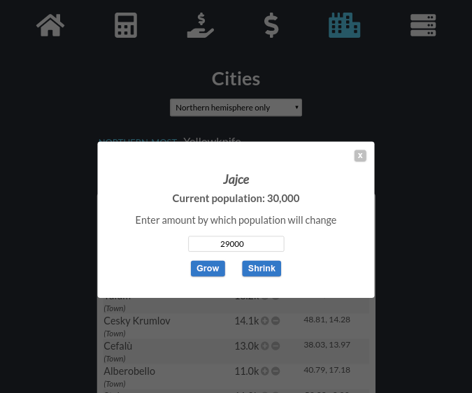</p>

&nbsp;

__Adjusting a city's population affects the community's total population, and can cause a change in the city's status:__

In this case, Jajce went from being a 'Large town' to a 'Village'
<p align="center">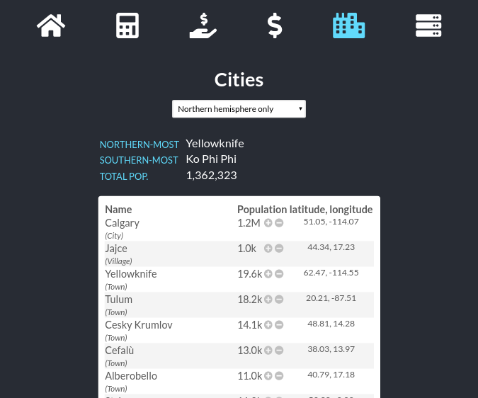</p>


&nbsp;
&nbsp;


### Data structures
_[Solution for Comp 150 - JavaScript Algorithms](src/assignments/Comp%20150%20-%20JavaScript%20Algorithms.pdf)_
<p align="center">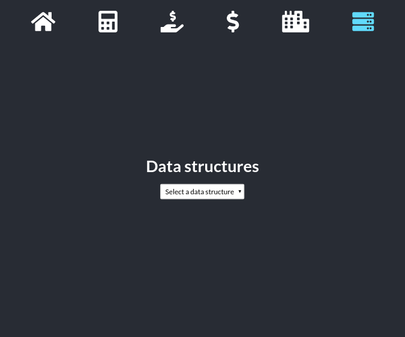</p>

&nbsp;

#### Development notes
The first portion of [this assignment](src/assignments/Comp%20150%20-%20JavaScript%20Algorithms.pdf) involved development of a linked list, using two classes: `Node` and `LinkedList`. The assignment specified that the `Node` class should have these attributes:

* `subject` : stores a string
* `amount` : stores a numeric value
* `forwardNode` : stores a reference to another `Node`
* `show()` : displays the `subject` and `amount`

The `LinkedList` was specified to be a collection of Nodes, with the current position in the list stored in state. Insertion in the list was required to be _after_ the current position. Deletion would remove the `Node` at the current position. A set of methods (`first`, `last`, `next`, `previous`) would allow for movement of position through the list. Finally, a `total` function was required, which would display the total of the amounts of the Nodes in the list.

I disliked the idea of having `Node` and `LinkedList` classes that could only handle one sort of data (`subject` &amp; `amount`) - my preference was to develop these classes in a logical, compartmentalised, data-agnostic manner. A `Node` should not care or know what kind of data is stored inside of it, and a `LinkedList` should only know that it contains Nodes - not the structure of the data inside those Nodes!

After some thought, I managed to come up with a solution that satisfied both the assignment's requirements, and my desire to develop generic, reusable `Node` and `LinkedList` classes.

Using TDD, I developed a [`Node` class](src/components/js/Node.js) with attributes:
* `data` : stores any Object or primitive data type
* `next` : stores a reference to another `Node`
* `show()` : checks the type of `data` - if it's a primitive, it can easily be printed, and if it's an Object it's keys & values are enumerated and then printed.

This approach allows the `Node` class to handle any kind of data. Once the `Node` class was complete, I used TDD to develop a positional [`LinkedList` class](src/components/js/LinkedList.js):

__PROPERTIES__
* `head`        - points (i.e. stores a reference) to the first Node of the list
* `tail`        - points to the last Node of the list
* `position`    - points to the 'current Node'. The current Node is the last Node in
              the list (i.e. the 'tail'), until 'position' is moved via one of
              the positional methods (`first, last, next, previous`) to
              point to another Node
   - `position` determines the behaviour of `insert` and `delete` (see below for details)
* `length`      - the number of Nodes in the list


__METHODS__
* `insert()`    - inserts a new Node after the current Node, and makes the
              new Node the current Node
* `delete()`    - removes the current Node, and makes the previous Node the
              the current Node
* `first()`     - makes the head the current Node
* `last()`      - makes the tail the current Node
* `next()`      - makes the next Node the current Node
* `previous()`  - makes the previous Node the current Node
* `map(callback)` - returns an Array containing the results of calling the provided `callback` function on every Node in the in sequence, from head to tail


__NOTES__
- All methods allow call chaining
- Empty list : `head`, `tail`, `position` are null and `length` is 0
- The only way to replace the `head`, `tail`, or any Node in the list, is to move `position` to the target Node (thus making it the current Node), delete it, and then insert new Node(s) if desired.

Once TDD of the `LinkedList` class was complete, I could finally proceed.

---

In order to satisfy the assignment's requirement of `subject` &amp; `amount` data stored in Nodes, I decided to create a `Movie` class, with a `title` property corresponding to the `subject`, and a `gross` property corresponding to the `amount`. `Movie` objects could then be stored in the nodes of a linked list.

One outstanding issue however, was that the linked list was required to have a `total` function, which would display the total of the amounts of the Nodes in the list. This was not possible with my generic `LinkedList` class.

I therefore developed a [`MoviesList` class](src/components/js/MoviesList.js) which extended my LinkedList class, and only added one method: `totalGross`, which would return the total gross of all movies stored in the list.

_NOTE: View test coverage report at 'coverage/lcov-report/src/img/components/js/index.html' after cloning the repo._

Test driven development of the [Queue](src/components/js/Queue.js) and [Stack](src/components/js/Stack.js) classes was done using JS' native Array and its methods (as required by the assignment) and was trivial. 

The tested &amp; verified classes were then used in React.

&nbsp;

__Data structure selection:__

The user can choose between a linked list, queue, and stack which have been populated with movie gross data, or begin with an empty data structure.
<p align="center"></p>

&nbsp;

__Linked List:__

By default, the current Node is the tail until position is adjusted. The current node/position can be adjusted using the chevron glyph controls, or by clicking on a node.
<p align="center">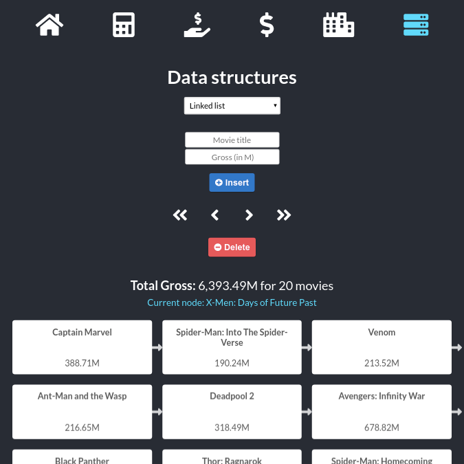</p>

&nbsp;

__Position set to 'head':__

Using a chevron control, position in the list has been set to the first node.
<p align="center">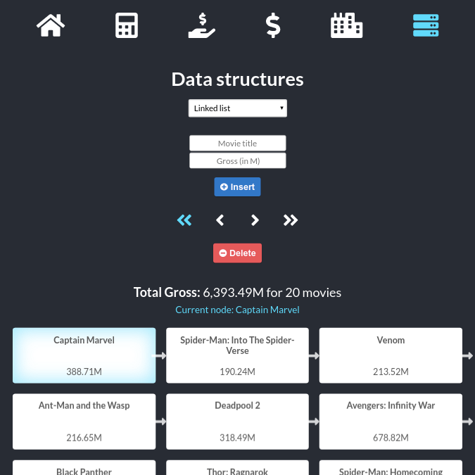</p>

&nbsp;

__Clicking on a node to set position in the list:__
<p align="center">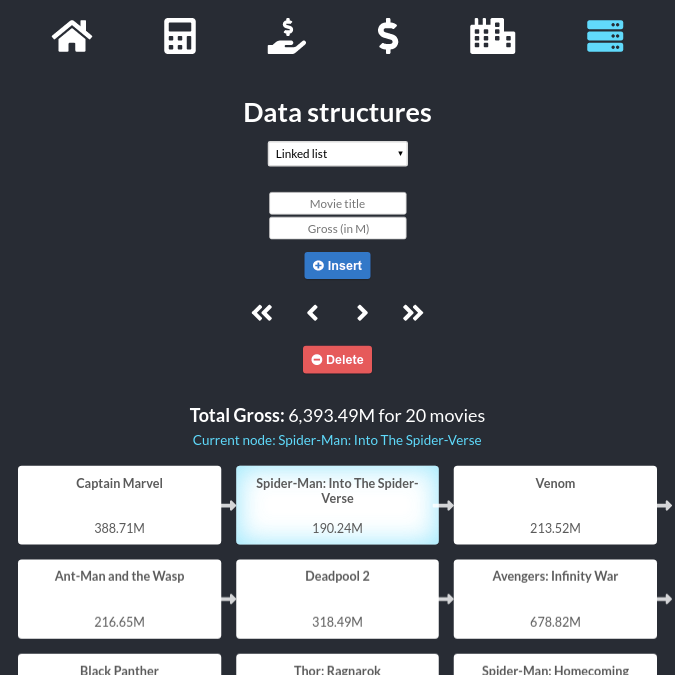</p>

&nbsp;

__Deleting the current node makes the previous Node the current Node:__
<p align="center">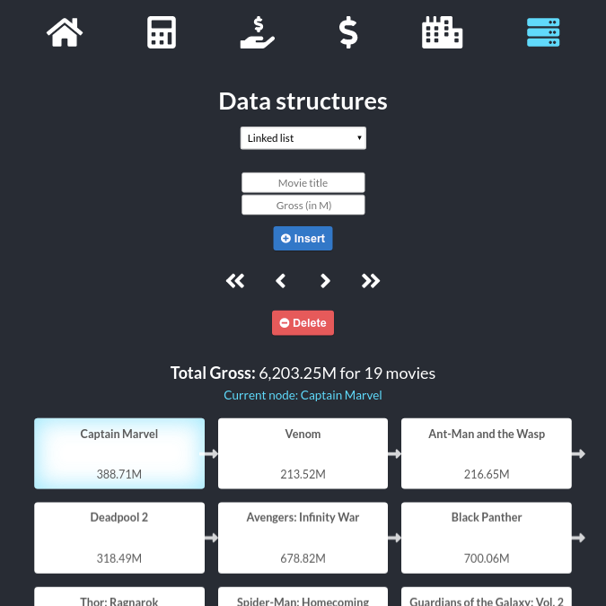</p>

&nbsp;

__Queue - the first movie in the queue (marked/highlighted) is the first one out:__
<p align="center">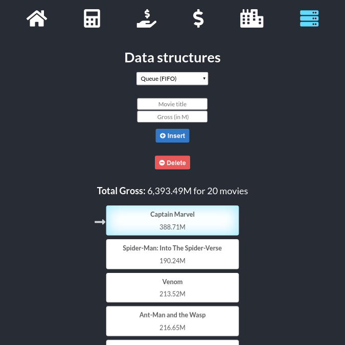</p>

&nbsp;

__Queue - the last movie in the stack (marked/highlighted) is the first one out:__
<p align="center">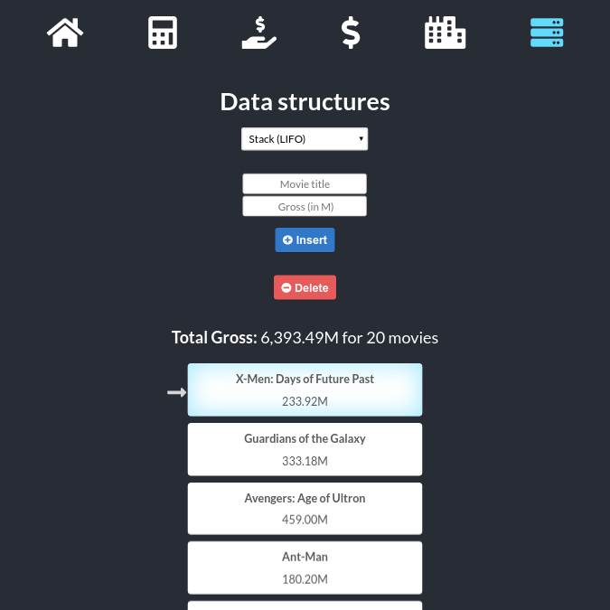</p>

&nbsp;


## [&uarr; TOP](#react-spa)


---

> LinkedIn [omar.codes](http://omar.codes/) &nbsp;&middot;&nbsp;
> GitHub [OmarHussainX](https://github.com/OmarHussainX/) &nbsp;&middot;&nbsp;
> Twitter [@OmarHussainX](https://twitter.com/OmarHussainX)