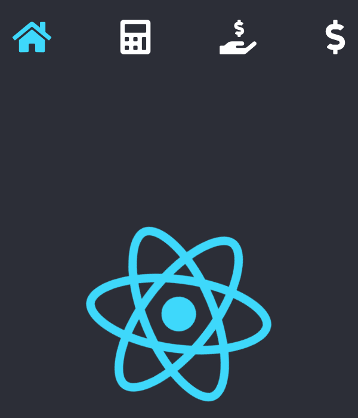

<p align="center">
<!--  -->

</p>

# EvolveU Competencies
Showcasing solutions for some of the competencies assigned in EvolveU's [Full Stack Developer Program](https://www.evolveu.ca/program).


## How To Use

You'll need [Git](https://git-scm.com) and [Node.js](https://nodejs.org/en/download/) (which comes with [npm](http://npmjs.com)) installed:

```bash
# Clone repository
$ git clone https://github.com/OmarHussainX/evolveu-competencies

# Enter project folder
$ cd evolveu-competencies

# Install dependencies
$ npm install

# Run (should launch in browser, typically at http://localhost:3000/)
$ npm start
```


---

> LinkedIn [omar.codes](http://omar.codes/) &nbsp;&middot;&nbsp;
> GitHub [OmarHussainX](https://github.com/OmarHussainX/) &nbsp;&middot;&nbsp;
> Twitter [@OmarHussainX](https://twitter.com/OmarHussainX)