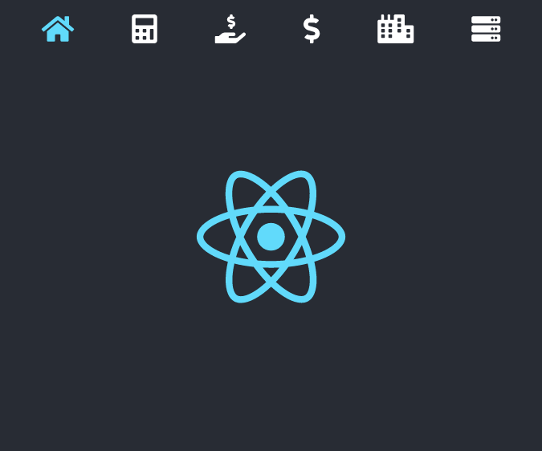
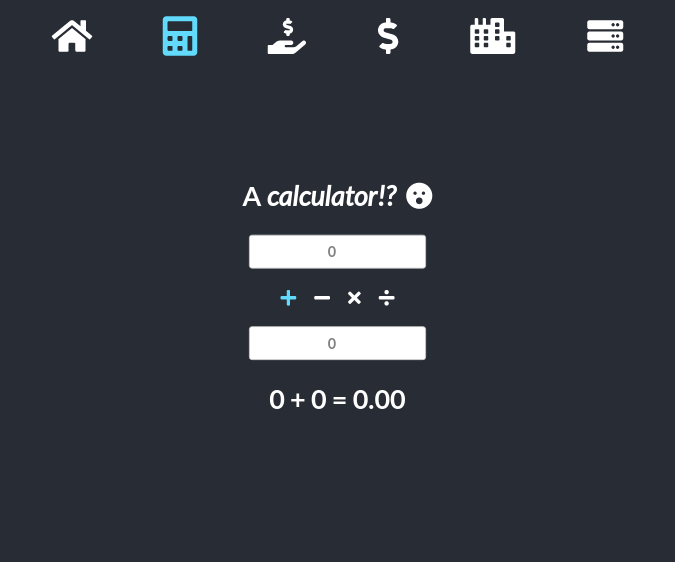

<p align="center">

</p>

#  React SPA
 A single page app (SPA) built with [React](https://reactjs.org/), showcasing solutions for the [JavaScript &amp; React competencies](src/assignments) assigned in EvolveU's [Full Stack Developer Program](https://www.evolveu.ca/program).


## Installation

You'll need [Git](https://git-scm.com), [Node.js](https://nodejs.org/en/download/) and [npm](http://npmjs.com) installed ([Node.js](https://nodejs.org/en/download/) includes [npm](http://npmjs.com))

```bash
# Clone repository
$ git clone https://github.com/OmarHussainX/evolveu-competencies

# Enter project folder
$ cd evolveu-competencies

# Install dependencies
$ npm install

# Run (should launch in browser, typically at http://localhost:3000/)
$ npm start
```


## Usage
<p align="center"></p>

Use the icons at the top to navigate to different areas of the app. From left to right, these are:

* Home
* Calculator
* Manage a single bank account
* Manage multiple bank accounts (belonging to one user)
* View/manage a collection of cities, with filtering by hemisphere
* View/manage box office gross data in three different data structures


### Home
_[Solution for Comp 120 - ReactJS](src/assignments/Comp%20120%20-%20ReactJS.pdf)_

Displays the React logo.


### Calculator
_[Solution for Comp 130 - JavaScript TDD](src/assignments/Comp%20130%20-%20JavaScript%20TDD.pdf)_
<p align="center"></p>

An exercise in TDD using jest.
1. Write tests for basic mathematical functions (addition, subtraction, multiplication, division)
2. Write stubs for the mathematical functions
3. Run tests, which _will_ fail
4. Select _one_ function stub and write its code
5. Run tests
..* If tests for the updated function pass, go to step 4
..* Otherwise, revise the code for the function under development and go step 5
6. Repeat steps 4-5 until all code has been written and all tests pass
7. Check for opportunities to refactor/optimise code
8. If a change is made to code, re-run tests - if any fail, resolve them one by one until all tests pass
---

> LinkedIn [omar.codes](http://omar.codes/) &nbsp;&middot;&nbsp;
> GitHub [OmarHussainX](https://github.com/OmarHussainX/) &nbsp;&middot;&nbsp;
> Twitter [@OmarHussainX](https://twitter.com/OmarHussainX)